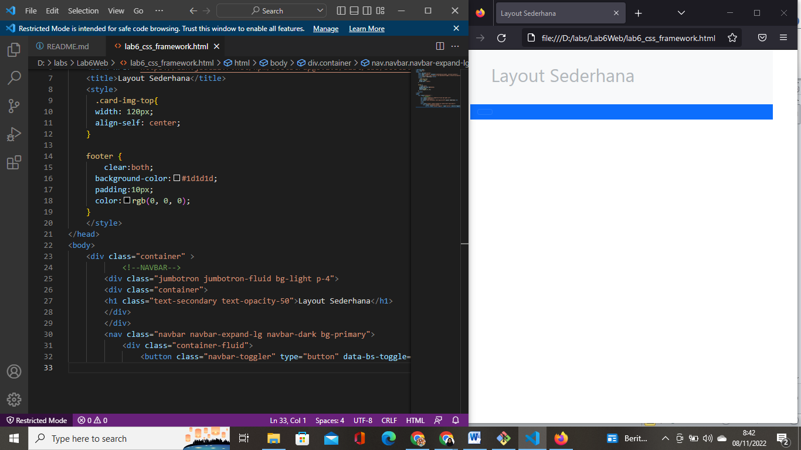
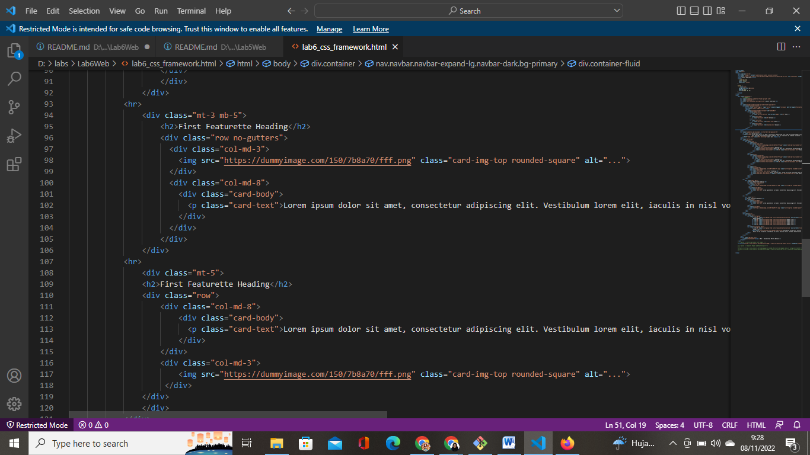

# Lab6Web
## Belajar Membuat Layout dengan Bootstrap

### Membuat layout
Pertama, buatlah dokumen html dengan nama file lab6_css_framework.html dan tambahkan kode sebagai berikut begini tampilannya :

### Membuat Navigasi dan Hero Panel
Lalu tambahkan syntax untuk mengatur navigasi sebagai berikut:

Lalu, berikutnya menambahkan syntax untuk membuat hero panel, begini tampilannya:

### Membuat Konten Artikel
berikutnya kita membuat konten artikel pada html dengan memasukkan syntax sebagi berikut:

### Membuat Layout Main dan Sidebar Widget
Masukkan Syntax seperti pada gambar berikut . beginilah tampilannya:

### Menambahkan Footer
Lalu yang terakhir adalah menambahkan footer dengan tampilan berikut:

# Hasil dari Pratikum Hari Ini

